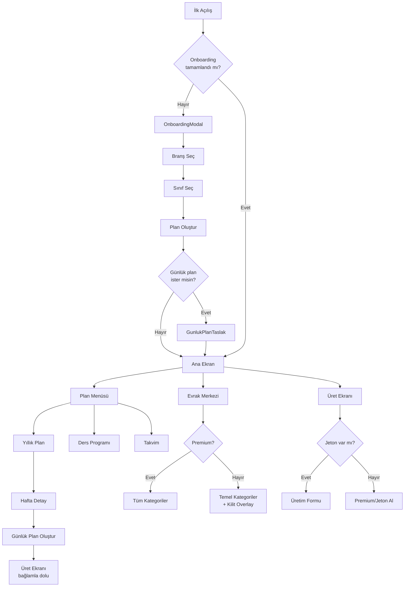

# Design Document — Öğretmen Yaver UX Redesign

## Overview

Öğretmen Yaver, Türkiye K-12 öğretmenlerinin bürokratik yükünü azaltmak için tasarlanmış mobil-öncelikli bir PWA'dır. Bu redesign, mevcut çalışan altyapı (React 19 + TypeScript + Vite + Tailwind CSS 4 + Supabase + React Router 7) üzerine inşa edilir; yeni bir stack getirilmez.

### Tasarım Felsefesi

Üç UX ilkesi tüm kararları yönlendirir:

- **30 saniye kuralı** — Her akış max 3 dokunuş, her ekran anında değer verir.
- **Sıfır boş sayfa** — Pre-filled veya AI taslak; kullanıcı hiçbir zaman boş ekranla karşılaşmaz.
- **İlk çıktı = bağlılık** — İlk oturumda somut PDF çıktısı alınabilir.

### Kullanım Modları

| Mod | Bağlam | Süre | Öncelik |
|-----|--------|------|---------|
| Teneffüs Modu | Telefon, ayakta | 5-10 dk | Hız, tek dokunuş |
| Evrak Modu | Akşam/hafta sonu | 30+ dk | Derinlik, toplu işlem |

### Mimari Karar: Mevcut Stack'e Sadık Kalma

Yeni bir framework veya state management kütüphanesi eklenmez. Gerekçe:
- Mevcut kod zaten çalışıyor; yeniden yazma riski yüksek.
- React 19 concurrent features + Supabase realtime yeterli.
- Tailwind CSS 4 custom properties sistemi (`--color-*`, `--radius-*`) tasarım tutarlılığını sağlıyor.
- Dynamic import ile müfredat yükleme (61 JSON) zaten optimize.

Eklenen tek bağımlılık: **`jspdf` + `jspdf-autotable`** (PDF üretimi için, zaten export utils'te mevcut olabilir).

---

## Architecture

### Katman Yapısı

```
┌─────────────────────────────────────────┐
│           React UI Layer                │
│  Pages / Components / AppLayout         │
├─────────────────────────────────────────┤
│         Custom Hooks Layer              │
│  usePlanYonetimi / useAuthSync /        │
│  useDersProgrami / useOnemliTarihler    │
├─────────────────────────────────────────┤
│           Service Layer                 │
│  planBuilder / exportUtils /            │
│  evrakService / tokenService            │
├─────────────────────────────────────────┤
│         Storage Layer                   │
│  localStorage (offline) ←→ Supabase    │
└─────────────────────────────────────────┘
```

### Veri Akışı

```
Kullanıcı Eylemi
    │
    ▼
React Component (optimistic UI güncelleme)
    │
    ├──► localStorage (anında, offline-first)
    │
    └──► Supabase (arka planda, auth varsa)
              │
              └──► useAuthSync (cloud → local merge)
```

**Offline-first prensibi**: Tüm okuma/yazma işlemleri önce localStorage'a gider. Supabase sync arka planda çalışır. Bağlantı kesilirse uygulama çalışmaya devam eder.

### Route Yapısı

```
/                          → HomePage (landing)
/app                       → AppHomeScreen
/app/planla                → PlanPage
  /app/planla/ders-programi  → DersProgramiPage (YENİ)
  /app/planla/takvim         → OnemliTarihlerPage (YENİ)
/app/hafta/:haftaNo        → HaftaDetayPage
/app/dosyam                → DosyamPage (genişletildi)
/app/uret                  → UretPage
/app/profil                → AppSettingsScreen
/app/yukle                 → YuklemePage
```

Alt sayfalar (`/app/planla/*`) AppLayout içinde render edilir; bottom nav aktif tab'ı "Planla" olarak gösterir.

### Freemium Katman Mimarisi

```
┌─────────────────────────────────────────┐
│  FREE TIER                              │
│  • Yıllık plan oluşturma (sınırsız)     │
│  • Temel evrak indirme (5 kategori)     │
│  • Aylık 3 jeton AI üretimi             │
│  • Ders programı girişi                 │
│  • Önemli tarihler takvimi              │
├─────────────────────────────────────────┤
│  PREMIUM TIER (149 TL/ay)               │
│  • Sınırsız jeton                       │
│  • Kulüp dosyası şablonları             │
│  • Sınıf rehberlik evrakları            │
│  • Zümre tutanağı şablonları (gelişmiş) │
│  • Öncelikli destek                     │
└─────────────────────────────────────────┘
```

Premium kontrolü `useSubscription` hook'u üzerinden yapılır. Backend hazır olmadan UI'da `isPremium: boolean` flag'i localStorage'da tutulur (stub).

---

## Components and Interfaces

### Bileşen Hiyerarşisi

```
App
├── AppLayout
│   ├── BottomNav (mevcut, değişmez)
│   └── main (page content)
│
├── AppHomeScreen (genişletildi)
│   ├── TopBar (selamlama + bildirim + ayarlar)
│   ├── UyariKarti (acil görevler)
│   ├── BugunDersleri (YENİ — ders programından)
│   ├── BuHaftaKazanim (mevcut hero)
│   ├── TasarrufKarti (mevcut)
│   └── HizliErisimGrid (Dosyam, Jeton, Ders Programı)
│
├── PlanPage (genişletildi)
│   ├── PlanHeroCard
│   ├── SinifSecici
│   ├── PlanAltSekmeler (YENİ — Yıllık | Ders Prog. | Takvim)
│   ├── DonemGrubu (mevcut)
│   ├── DersProgramiGrid (YENİ)
│   └── OnemliTarihlerListesi (YENİ)
│
├── DosyamPage (genişletildi)
│   ├── DosyaHeroCard
│   ├── OncelikUyarisi
│   ├── BelgeGrubu × N (kategoriler)
│   │   └── BelgeItem
│   └── PremiumKilit (premium olmayan kategoriler için)
│
├── UretPage (mevcut, küçük değişiklik)
│   ├── JetonKarti
│   ├── AracGrid
│   └── UretimFormu
│
└── AppSettingsScreen (genişletildi)
    ├── OkulBilgileri
    ├── ZumreOgretmenleri (dinamik liste)
    ├── IlkkeriyeAlani (koşullu)
    ├── TemaSecimi
    └── BildirimTercihleri
```

### Yeni Bileşenler

#### `DersProgramiGrid`

```tsx
interface DersProgramiGridProps {
  program: DersProgrami
  onHucreGuncelle: (gun: Gun, saat: number, sinif: string | null) => void
  readOnly?: boolean
}
```

5 sütun (Pzt-Cum) × 8+ satır (ders saatleri). Her hücre tıklanabilir; sınıf seçici bottom sheet açar. Çakışma durumunda hücre kırmızı border alır.

#### `OnemliTarihlerListesi`

```tsx
interface OnemliTarihlerListesiProps {
  tarihler: OnemliTarih[]
  onEkle: (tarih: OnemliTarih) => void
  onSil: (id: string) => void
}
```

Tarihler yakınlığa göre sıralanır. 7 gün içindekiler amber badge alır. 1 gün içindekiler kırmızı badge alır.

#### `PremiumKilit`

```tsx
interface PremiumKilitProps {
  ozellik: string
  onYukselt: () => void
}
```

Kilitli kategorilerin üzerine overlay olarak gelir. "Premium'a Geç" CTA içerir.

#### `GunlukPlanTaslak`

```tsx
interface GunlukPlanTaslakProps {
  hafta: Hafta
  sinif: string
  ders: string
  onKaydet: (plan: GunlukPlan) => void
  onIndir: (plan: GunlukPlan) => void
}
```

Onboarding'de ve HaftaDetayPage'de kullanılır. Kazanım, yöntem, etkinlik alanlarını içerir.

### Değişen Bileşenler

| Bileşen | Değişiklik |
|---------|-----------|
| `AppHomeScreen` | `BugunDersleri` kartı eklendi; ders programı yoksa davet kartı gösterilir |
| `PlanPage` | Alt sekme navigasyonu eklendi (Yıllık / Ders Prog. / Takvim) |
| `DosyamPage` | Kategori sistemi gerçek şablonlarla dolduruldu; premium kilit eklendi |
| `OnboardingModal` | Adım 3: "Günlük plan oluşturayım mı?" seçeneği eklendi |
| `AppSettingsScreen` | Zümre listesi, ilkkeriye alanı, bildirim tercihleri eklendi |

---

## Data Models

### Mevcut Modeller (değişmez)

```typescript
// src/types/planEntry.ts — mevcut
interface PlanEntry {
  sinif: string
  sinifGercek?: string
  ders: string
  yil: string
  tip: 'meb' | 'yukle'
  plan: Plan | null
  rows: ParsedRow[] | null
  label?: string
}
```

### Yeni Modeller

#### `DersProgrami`

```typescript
type Gun = 'Pazartesi' | 'Salı' | 'Çarşamba' | 'Perşembe' | 'Cuma'

interface DersSaati {
  gun: Gun
  saat: number          // 1-8 (ders saati sırası)
  sinif: string | null  // null = boş saat
  ders?: string         // sinif varsa otomatik doldurulur
}

interface DersProgrami {
  id: string
  ogretmenId: string    // Supabase user id veya 'local'
  haftaBaslangic: string // ISO date — hangi haftadan itibaren geçerli
  saatler: DersSaati[]
  olusturmaTarihi: string
  guncellemeTarihi: string
}
```

**localStorage key**: `StorageKeys.DERS_PROGRAMI = 'ders_programi'`

**Supabase tablo**: `ders_programlari` (ogretmen_id, hafta_baslangic, saatler jsonb)

#### `OnemliTarih`

```typescript
type OnemliTarihKategori =
  | 'zha'           // Zümre Hazırlık/Değerlendirme
  | 'not-girisi'    // Not girişi son günü
  | 'veli-toplantisi'
  | 'sinav'
  | 'tatil'         // MEB takviminden otomatik
  | 'diger'

interface OnemliTarih {
  id: string
  tarih: string           // ISO date
  baslik: string
  kategori: OnemliTarihKategori
  aciklama?: string
  otomatik: boolean       // MEB takviminden mi geldi?
  bildirimGonderildi: boolean
}
```

**localStorage key**: `StorageKeys.ONEMLI_TARIHLER = 'onemli_tarihler'`

#### `GunlukPlan`

```typescript
interface GunlukPlan {
  id: string
  haftaNo: number
  gun: Gun
  sinif: string
  ders: string
  kazanim: string
  yontem: string[]        // ['Soru-Cevap', 'Grup Çalışması', ...]
  etkinlikler: string[]
  materyaller: string[]
  sure: number            // dakika
  notlar?: string
  olusturmaTarihi: string
}
```

**localStorage key**: `StorageKeys.GUNLUK_PLANLAR = 'gunluk_planlar'`

#### `OgretmenAyarlari` (genişletildi)

```typescript
interface OgretmenAyarlari {
  adSoyad: string
  okulAdi: string
  mudurAdi: string
  mudurYardimcisiAdi?: string
  zumreOgretmenleri: string[]   // YENİ
  ilkkeriyeGrubu?: string       // YENİ — ilkokul branşı için
  ilkkeriyeYontemi?: string     // YENİ
  bildirimTercihleri: {         // YENİ
    onemliTarihler: boolean
    haftaBaslangici: boolean
  }
}
```

**localStorage key**: `StorageKeys.OGRETMEN_AYARLARI` (mevcut, genişletildi)

#### `JetonDurumu`

```typescript
interface JetonDurumu {
  bakiye: number
  aylikHak: number        // free: 3, premium: Infinity
  kullanilanBuAy: number
  sonYenileme: string     // ISO date
  isPremium: boolean
}
```

**localStorage key**: `StorageKeys.JETON_DURUMU = 'jeton_durumu'`

#### `EvrakSablon`

```typescript
type EvrakKategori =
  | 'ogretmen-dosyasi'
  | 'kulup-evraklari'     // premium
  | 'zumre-tutanaklari'
  | 'sinif-rehberlik'     // premium
  | 'genel-bürokratik'

interface EvrakSablon {
  id: string
  kategori: EvrakKategori
  ad: string
  aciklama: string
  premium: boolean
  zorunluAlanlar: string[]  // ['okulAdi', 'mudurAdi', ...]
  templatePath: string      // şablon dosyası yolu
}
```

### StorageKeys Güncellemesi

```typescript
// src/lib/storageKeys.ts — eklenecek
export const StorageKeys = {
  // mevcut
  TAMAMLANAN_HAFTALAR: 'tamamlanan_haftalar',
  OGRETMEN_AYARLARI: 'ogretmen_ayarlari',
  ONBOARDING_TAMAMLANDI: 'onboarding_tamamlandi',
  // yeni
  DERS_PROGRAMI: 'ders_programi',
  ONEMLI_TARIHLER: 'onemli_tarihler',
  GUNLUK_PLANLAR: 'gunluk_planlar',
  JETON_DURUMU: 'jeton_durumu',
} as const
```

### Supabase Şema Güncellemesi

```sql
-- Yeni tablolar
CREATE TABLE ders_programlari (
  id uuid PRIMARY KEY DEFAULT gen_random_uuid(),
  ogretmen_id uuid REFERENCES auth.users(id),
  hafta_baslangic date NOT NULL,
  saatler jsonb NOT NULL DEFAULT '[]',
  created_at timestamptz DEFAULT now(),
  updated_at timestamptz DEFAULT now()
);

CREATE TABLE onemli_tarihler (
  id uuid PRIMARY KEY DEFAULT gen_random_uuid(),
  ogretmen_id uuid REFERENCES auth.users(id),
  tarih date NOT NULL,
  baslik text NOT NULL,
  kategori text NOT NULL,
  aciklama text,
  otomatik boolean DEFAULT false,
  bildirim_gonderildi boolean DEFAULT false,
  created_at timestamptz DEFAULT now()
);

CREATE TABLE gunluk_planlar (
  id uuid PRIMARY KEY DEFAULT gen_random_uuid(),
  ogretmen_id uuid REFERENCES auth.users(id),
  hafta_no integer NOT NULL,
  gun text NOT NULL,
  sinif text NOT NULL,
  ders text NOT NULL,
  plan_data jsonb NOT NULL,
  created_at timestamptz DEFAULT now()
);

-- RLS
ALTER TABLE ders_programlari ENABLE ROW LEVEL SECURITY;
ALTER TABLE onemli_tarihler ENABLE ROW LEVEL SECURITY;
ALTER TABLE gunluk_planlar ENABLE ROW LEVEL SECURITY;

CREATE POLICY "Kendi verisi" ON ders_programlari
  FOR ALL USING (auth.uid() = ogretmen_id);
CREATE POLICY "Kendi verisi" ON onemli_tarihler
  FOR ALL USING (auth.uid() = ogretmen_id);
CREATE POLICY "Kendi verisi" ON gunluk_planlar
  FOR ALL USING (auth.uid() = ogretmen_id);
```

---

## Ekran Yapıları

### Ana Ekran (AppHomeScreen)

```
┌─────────────────────────────┐
│ Günaydın, [Ad]    🔔  ⚙️   │  ← TopBar
├─────────────────────────────┤
│ ⚠ ACİL: Not girişi son günü │  ← UyariKarti (koşullu)
│   10-B tamamlanmadı         │
├─────────────────────────────┤
│ BUGÜNÜN DERSLERİ            │  ← BugunDersleri (YENİ)
│ 09:00 │ 10-A │ Matematik    │
│ 10:00 │ 11-B │ Matematik    │
│ 13:00 │ 9-C  │ Matematik    │
├─────────────────────────────┤
│ BU HAFTA                    │  ← BuHaftaKazanim
│ [Kazanım metni...]          │
├─────────────────────────────┤
│ 6.5 saat geri aldınız       │  ← TasarrufKarti
│ Yazılı 3.2s │ Evrak 2.1s   │
├─────────────────────────────┤
│ [Dosyam 14] [Jeton 7]       │  ← HizliErisimGrid
│ [+ Ders Programı Ekle]      │
└─────────────────────────────┘
```

Ders programı girilmemişse `BugunDersleri` yerine davet kartı gösterilir.

### Plan Menüsü (PlanPage) — Alt Sekmeler

```
┌─────────────────────────────┐
│ Planlama                    │
│ Yıllık · Haftalık · Prog.   │
├─────────────────────────────┤
│ [Yıllık Plan][Ders Prog.][Takvim] │  ← PlanAltSekmeler
├─────────────────────────────┤
│ (Yıllık Plan sekmesi)       │
│ ▼ 1. Dönem  ████░░ 12/18   │
│   1. Hafta  03-07 Eyl       │
│   2. Hafta  10-14 Eyl       │
│   ...                       │
│ ► 2. Dönem  ░░░░░░  0/18   │
├─────────────────────────────┤
│ [Excel İndir] [Word İndir]  │
└─────────────────────────────┘
```

**Ders Programı sekmesi:**

```
┌─────────────────────────────┐
│     Pzt  Sal  Çar  Per  Cum │
│ 1.  [10A][   ][11B][   ][9C]│
│ 2.  [   ][10A][   ][11B][  ]│
│ ...                         │
│ [Kaydet]                    │
└─────────────────────────────┘
```

Hücreye dokunulunca bottom sheet açılır; mevcut sınıflar listelenir.

**Takvim sekmesi:**

```
┌─────────────────────────────┐
│ Önemli Tarihler             │
│ + Tarih Ekle                │
├─────────────────────────────┤
│ 🔴 Yarın — Not Girişi       │
│ 🟡 3 gün — ZHA Toplantısı   │
│ ⚪ 15 gün — Veli Toplantısı │
└─────────────────────────────┘
```

### Evrak Merkezi (DosyamPage) — Kategoriler

```
┌─────────────────────────────┐
│ Öğretmen Dosyası            │
│ 14 belge hazır              │
│ [Tüm Dosyayı İndir · PDF]   │
├─────────────────────────────┤
│ 📁 Öğretmen Dosyası         │
│   ✓ Yıllık Plan             │
│   ✓ ZHA Tutanakları (3)     │
│   ⚠ Nöbet Dökümü (eksik)   │
├─────────────────────────────┤
│ 📁 Zümre Tutanakları        │
│   ✓ Ekim ZHA                │
│   + Yeni Tutanak            │
├─────────────────────────────┤
│ 🔒 Kulüp Evrakları          │  ← Premium kilit
│   [Premium'a Geç]           │
├─────────────────────────────┤
│ 🔒 Sınıf Rehberlik          │  ← Premium kilit
└─────────────────────────────┘
```

---

## Navigasyon Akışı



---

## Error Handling

### Hata Kategorileri ve Stratejileri

| Hata | Strateji | UX |
|------|----------|-----|
| Müfredat JSON yüklenemedi | Retry × 3, sonra fallback boş plan | Toast: "Plan yüklenemedi, tekrar dene" |
| Supabase sync hatası | localStorage'da tut, arka planda retry | Sessiz; kritik değil |
| Jeton yetersiz | Üretimi engelle | Modal: premium/jeton al |
| Ders programı çakışması | Kaydetme, hücreyi kırmızı göster | Inline uyarı |
| PDF oluşturma hatası | Fallback: tarayıcı print dialog | Toast: "PDF oluşturulamadı" |
| Offline mod | Service Worker cache | Banner: "Çevrimdışı mod" |
| Eksik ayar alanları | Evrak oluşturmayı engelleme; uyarı göster | Inline badge + Ayarlar'a yönlendirme |

### Optimistic UI Prensibi

Tüm kullanıcı eylemleri önce UI'da yansıtılır, sonra persist edilir. Persist başarısız olursa rollback yapılır ve toast gösterilir. Bu sayede 3G'de bile uygulama hızlı hissettiriri.

---

## Testing Strategy

### Dual Testing Yaklaşımı

Her özellik için iki tür test yazılır:

1. **Unit testler** — Spesifik örnekler, edge case'ler, hata koşulları
2. **Property-based testler** — Evrensel özellikler, tüm geçerli girdiler için

Unit testler somut hataları yakalar; property testler genel doğruluğu doğrular. İkisi birbirini tamamlar.

### Property-Based Testing Konfigürasyonu

- **Kütüphane**: `fast-check` (TypeScript-native, Vitest ile uyumlu)
- **Minimum iterasyon**: Her property testi için 100 çalıştırma
- **Tag formatı**: `// Feature: ogretmen-yaver-ux-redesign, Property N: <property_text>`
- Her correctness property → tek bir property-based test

### Unit Test Odak Alanları

- Ders programı çakışma tespiti (edge case: aynı saate iki sınıf)
- Jeton bakiye hesaplama (edge case: bakiye = 0)
- Evrak şablonu doldurma (eksik alan kombinasyonları)
- Tarih yakınlık hesaplama (edge case: bugün = tarih)
- Offline/online geçiş (mock Service Worker)

### Property Test Odak Alanları

Aşağıdaki Correctness Properties bölümünde tanımlanan her property için bir test.

---

## Correctness Properties

*A property is a characteristic or behavior that should hold true across all valid executions of a system — essentially, a formal statement about what the system should do. Properties serve as the bridge between human-readable specifications and machine-verifiable correctness guarantees.*

### Property 1: Branş → Sınıf Listesi Tutarlılığı

*For any* branş seçimi, döndürülen sınıf listesi o branşın geçerli sınıf aralığıyla tam örtüşmeli ve boş olmamalıdır.

**Validates: Requirements 1.2**

---

### Property 2: Günlük Plan Taslağı Oluşturulabilirliği

*For any* geçerli hafta numarası, sınıf ve ders kombinasyonu, günlük plan taslağı oluşturma işlemi en az kazanım, yöntem ve etkinlik alanlarını içeren bir nesne döndürmelidir.

**Validates: Requirements 1.6, 3.4**

---

### Property 3: Ders Programı → Ana Ekran Sıralama Doğruluğu

*For any* ders programı ve herhangi bir gün, o gün için listelenen dersler ders programındaki saat sırasına göre artan düzende olmalıdır.

**Validates: Requirements 2.2, 7.4**

---

### Property 4: Zaman Tasarrufu Hesaplama Monotonluğu

*For any* iki tamamlanan görev seti A ⊆ B, B için hesaplanan zaman tasarrufu A için hesaplanan zaman tasarrufundan büyük veya eşit olmalıdır (daha fazla görev = daha fazla tasarruf).

**Validates: Requirements 2.4**

---

### Property 5: Bildirim Sayısı Tutarlılığı

*For any* önemli tarihler listesi, bildirim ikonunda gösterilen sayı yaklaşan (bugün veya gelecekte olan) tarih sayısıyla eşit olmalıdır.

**Validates: Requirements 2.7**

---

### Property 6: Hafta Detayı Eksiksizliği

*For any* yıllık plandaki hafta, hafta detay görünümünde kazanım, ünite adı ve tarih aralığı alanlarının tamamı mevcut olmalıdır (tatil haftaları için tatil adı yeterlidir).

**Validates: Requirements 3.2**

---

### Property 7: Export Çıktı Geçerliliği

*For any* geçerli PlanEntry nesnesi, Excel ve Word export fonksiyonları sıfırdan büyük boyutta bir dosya üretmelidir (boş çıktı üretmemelidir).

**Validates: Requirements 3.3**

---

### Property 8: Tarih Yakınlık Sınıflandırması

*For any* önemli tarih ve referans tarihi (bugün), yakınlık hesaplama fonksiyonu şu kuralları tutarlı biçimde uygulamalıdır: ≤1 gün → 'kritik', ≤7 gün → 'yaklasan', >7 gün → 'normal'. Bu sınıflandırma tüm geçerli tarih çiftleri için geçerlidir.

**Validates: Requirements 3.8, 8.3, 8.4**

---

### Property 9: Önemli Tarih Round-Trip

*For any* geçerli OnemliTarih nesnesi, localStorage'a kaydedip geri okumak orijinal nesneyle eşdeğer bir nesne üretmelidir (id, tarih, başlık, kategori alanları korunmalıdır).

**Validates: Requirements 8.2**

---

### Property 10: MEB Takvimi Otomatik Yükleme

*For any* geçerli öğretim yılı, MEB takvim verisi yükleme fonksiyonu en az bir tatil veya dönem tarihi içeren boş olmayan bir liste döndürmelidir.

**Validates: Requirements 8.5**

---

### Property 11: Evrak Kategorileme Tutarlılığı

*For any* EvrakSablon nesnesi, kategori alanı geçerli EvrakKategori değerlerinden biri olmalı ve premium alanı o kategorinin premium gerektirip gerektirmediğiyle tutarlı olmalıdır.

**Validates: Requirements 4.1**

---

### Property 12: Evrak Şablonu Doldurma Round-Trip

*For any* OgretmenAyarlari nesnesi ve herhangi bir evrak şablonu, şablon doldurma fonksiyonu ayarlardaki tüm zorunlu alanları çıktıda içermelidir.

**Validates: Requirements 4.3, 5.6**

---

### Property 13: Eksik Alan Tespiti Kapsamlılığı

*For any* evrak şablonu ve herhangi bir OgretmenAyarlari nesnesi, eksik alan tespiti fonksiyonu şablonun `zorunluAlanlar` listesindeki tüm eksik alanları raporlamalıdır — hiçbirini atlamamalıdır.

**Validates: Requirements 4.4, 4.7**

---

### Property 14: Premium Erişim Kontrolü Tutarlılığı

*For any* kullanıcı durumu (premium veya free), premium gerektiren her özellik için erişim kontrolü fonksiyonu isPremium=true ise erişime izin vermeli, isPremium=false ise reddetmelidir. Bu kural tüm premium özellikler için tutarlı biçimde uygulanmalıdır.

**Validates: Requirements 4.6, 6.7, 9.2**

---

### Property 15: Zümre Listesi Değişmezliği

*For any* zümre öğretmenleri listesi, ekleme işlemi listenin uzunluğunu tam olarak 1 artırmalı; silme işlemi tam olarak 1 azaltmalıdır. Liste hiçbir zaman negatif uzunlukta olamaz.

**Validates: Requirements 5.2**

---

### Property 16: Ayarlar Kaydetme Round-Trip

*For any* geçerli OgretmenAyarlari nesnesi, localStorage'a kaydedip geri okumak orijinal nesneyle derin eşit bir nesne üretmelidir.

**Validates: Requirements 5.4**

---

### Property 17: Üretim Bağlamı Aktarımı

*For any* hafta + sınıf + ders kombinasyonu, Plan Menüsü'nden Üret Ekranı'na geçişte form alanlarındaki kazanım ve sınıf değerleri kaynak verilerle eşleşmelidir.

**Validates: Requirements 6.3**

---

### Property 18: Jeton Maliyeti Görünürlüğü

*For any* üretim aracı, araç kartında gösterilen jeton maliyeti sıfırdan büyük bir tam sayı olmalıdır.

**Validates: Requirements 6.5**

---

### Property 19: Jeton Tier Limiti Uygulaması

*For any* kullanıcı tier'ı (free veya premium), aylık kullanılan jeton sayısı free tier için 3'ü geçemez; premium tier için limit yoktur. Abonelik sona erdiğinde bakiye free tier limitine düşürülmelidir.

**Validates: Requirements 9.1, 9.5**

---

### Property 20: Ders Programı Çakışma Tespiti

*For any* ders programı ve herhangi bir (gün, saat) çifti, aynı slota ikinci bir sınıf atanmaya çalışıldığında çakışma tespiti fonksiyonu true döndürmelidir.

**Validates: Requirements 7.5**

---

### Property 21: Ders Programı Kaydetme Round-Trip

*For any* geçerli DersProgrami nesnesi, localStorage'a kaydedip geri okumak orijinal saatler dizisiyle eşdeğer bir nesne üretmelidir.

**Validates: Requirements 7.3**

---

### Property 22: Dokunma Hedefi Boyut Invariantı

*For any* interaktif UI elementi (button, link, tıklanabilir div), rendered boyutu hem genişlik hem yükseklik açısından 44px'den küçük olmamalıdır.

**Validates: Requirements 10.2**

---

### Property 23: Offline Veri Erişilebilirliği

*For any* daha önce localStorage'a kaydedilmiş plan veya evrak verisi, ağ bağlantısı olmadan da okunabilir olmalıdır (undefined veya null döndürmemelidir).

**Validates: Requirements 10.3**

