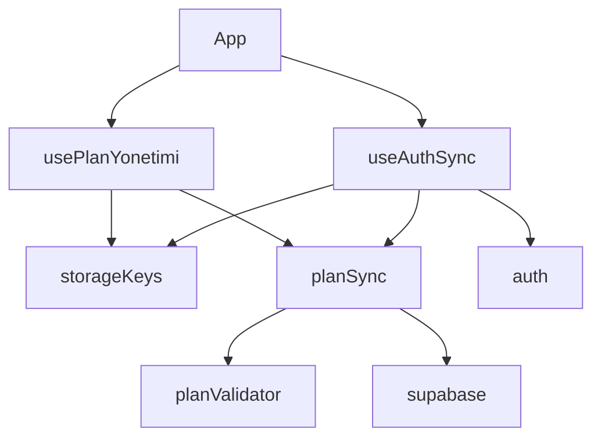

# Tasarım Belgesi — Teknik Borç ve Mimari İyileştirmeler

## Genel Bakış

Bu belge, Yıllık Plan uygulamasının mevcut teknik borçlarını gidermek için yapılacak mimari değişikliklerin tasarımını içermektedir. Beş bağımsız iyileştirme ele alınmaktadır:

1. Eski routing akışının (`/olustur`, `/yukle`, `/plan`) kaldırılıp `/app` altına yönlendirilmesi
2. `localStorage` anahtarlarının `storageKeys.ts` modülünde merkezileştirilmesi
3. `App.tsx`'in `usePlanYonetimi` ve `useAuthSync` hook'larına bölünmesi
4. `YuklemePage`'in `AppLayout` içine alınması
5. Supabase plan JSON'ı için `PlanValidator` ile çalışma zamanı tip güvenliği

Değişiklikler birbirinden bağımsız olup sıralı veya paralel uygulanabilir. Hiçbiri mevcut veri modelini bozmaz; yalnızca kod organizasyonunu ve tip güvenliğini iyileştirir.

---

## Mimari

### Mevcut Durum

```
App.tsx (~200 satır)
├── Auth state + Supabase sync (useEffect)
├── localStorage okuma/yazma (useEffect + inline)
├── Plan yönetimi (handlePlanEkle, handlePlanSil, handleSinifSec)
└── Router tanımları
    ├── /          → HomePage
    ├── /olustur   → PlanOlusturPage   ← kaldırılacak
    ├── /yukle     → YuklemePage       ← taşınacak
    ├── /plan      → PlanPage          ← kaldırılacak
    └── /app/**    → AppLayout içi rotalar
```

### Hedef Durum

```
App.tsx (~60-80 satır)
├── usePlanYonetimi()   → src/hooks/usePlanYonetimi.ts
├── useAuthSync()       → src/hooks/useAuthSync.ts
└── Router tanımları
    ├── /          → HomePage (güncellendi: /app ve /app/yukle)
    ├── /olustur   → <Navigate to="/app" />
    ├── /yukle     → <Navigate to="/app/yukle" />
    ├── /plan      → <Navigate to="/app/plan" />
    └── /app/**    → AppLayout içi rotalar
        └── /app/yukle → YuklemePage (AppLayout içinde)

src/lib/storageKeys.ts   ← yeni
src/lib/planValidator.ts ← yeni
src/hooks/usePlanYonetimi.ts ← yeni
src/hooks/useAuthSync.ts     ← yeni
```

### Bağımlılık Grafiği



---

## Bileşenler ve Arayüzler

### 1. `storageKeys.ts`

Tüm `localStorage` anahtarlarını `as const` ile dondurulmuş bir nesne olarak dışa aktarır. Bu sayede TypeScript, yanlış anahtar kullanımını derleme zamanında yakalar.

```typescript
// src/lib/storageKeys.ts
export const StorageKeys = {
  TUM_PLANLAR:          'tum-planlar',
  AKTIF_SINIF:          'aktif-sinif',
  TAMAMLANAN_HAFTALAR:  'tamamlanan-haftalar',
  HAFTA_NOTLARI:        'hafta-notlari',
  ONBOARDING_TAMAMLANDI:'onboarding-tamamlandi',
  AUTH_PROMPT_GOSTERILDI:'auth-prompt-gosterildi',
  OGRETMEN_AYARLARI:    'ogretmen-ayarlari',
  BILDIRIM_AKTIF:       'bildirim-aktif',
  BILDIRIM_SON_HAFTA:   'bildirim-son-hafta',
} as const

export type StorageKey = typeof StorageKeys[keyof typeof StorageKeys]
```

### 2. `planValidator.ts`

Zod kullanmadan manuel type guard ile `PlanEntry` doğrulaması yapar. Geçersiz satırları filtreler ve konsola hata kaydeder.

```typescript
// src/lib/planValidator.ts
import type { PlanEntry } from '../types/planEntry'

export function isPlanEntry(value: unknown): value is PlanEntry {
  if (!value || typeof value !== 'object') return false
  const v = value as Record<string, unknown>
  return (
    typeof v.sinif === 'string' &&
    typeof v.ders === 'string' &&
    typeof v.yil === 'string' &&
    (v.tip === 'meb' || v.tip === 'yukle')
  )
}

export function validatePlanRows(rows: unknown[]): PlanEntry[] {
  return rows.filter((row): row is PlanEntry => {
    const valid = isPlanEntry(row)
    if (!valid) console.error('[PlanValidator] Geçersiz plan satırı:', row)
    return valid
  })
}
```

### 3. `usePlanYonetimi` Hook

Plan ekleme, silme ve aktif sınıf seçimi mantığını kapsar. `user` parametresini dışarıdan alır (bağımlılık enjeksiyonu).

```typescript
// src/hooks/usePlanYonetimi.ts
interface UsePlanYonetimiOptions {
  user: User | null
}

interface UsePlanYonetimiReturn {
  planlar: PlanEntry[]
  aktifSinif: string
  aktifEntry: PlanEntry | null
  yuklendi: boolean
  handlePlanEkle: (entries: PlanEntry[]) => void
  handlePlanSil: (sinif: string) => void
  handleSinifSec: (sinif: string) => void
  setAuthPromptAcik: (acik: boolean) => void
  authPromptAcik: boolean
}
```

### 4. `useAuthSync` Hook

Auth state değişikliklerini dinler, Supabase'den plan ve ilerleme verisi çeker, `localStorage` ile birleştirir.

```typescript
// src/hooks/useAuthSync.ts
interface UseAuthSyncReturn {
  user: User | null
  syncing: boolean
  tamamlananlar: Record<string, number[]>
}
```

### 5. `YuklemePage` Güncelleme

Bağımsız tam ekran arka plan stili kaldırılır; `AppLayout` düzeni devralır.

```typescript
// Kaldırılacak wrapper div:
// <div className="min-h-screen bg-gradient-to-br from-blue-50 to-indigo-100 ...">

// Yerine doğrudan içerik:
// <div className="p-4 max-w-md mx-auto">
```

---

## Veri Modelleri

### `PlanEntry` (mevcut, değişmez)

```typescript
interface PlanEntry {
  sinif: string        // benzersiz anahtar
  ders: string
  yil: string
  tip: 'meb' | 'yukle'
  plan: OlusturulmusPlan | null
  rows: ParsedRow[] | null
  label?: string
  sinifGercek?: string
}
```

### Supabase `plans` tablosu (mevcut, değişmez)

| Sütun | Tip | Açıklama |
|---|---|---|
| `user_id` | uuid | Kullanıcı kimliği |
| `sinif` | text | Benzersiz anahtar (user_id ile birlikte) |
| `ders` | text | Ders adı |
| `yil` | text | Öğretim yılı |
| `tip` | text | `'meb'` veya `'yukle'` |
| `plan_json` | jsonb | `OlusturulmusPlan` nesnesi |
| `rows_json` | jsonb | `ParsedRow[]` dizisi |
| `label` | text | Sekme görüntüleme adı |
| `sinif_gercek` | text | Gerçek sınıf adı |

### `planSync.ts` Güncelleme

`fetchPlansFromSupabase` içindeki `as unknown as object` cast'leri kaldırılır; `validatePlanRows` ile değiştirilir:

```typescript
// Eski (kaldırılacak):
return data.map(row => ({
  ...
  plan: row.plan_json ?? null,   // tip güvensiz
  rows: row.rows_json ?? null,   // tip güvensiz
}))

// Yeni:
const mapped = data.map(row => ({
  sinif: row.sinif,
  ders: row.ders,
  yil: row.yil,
  tip: row.tip,
  plan: row.plan_json ?? null,
  rows: row.rows_json ?? null,
  label: row.label ?? undefined,
  sinifGercek: row.sinif_gercek ?? undefined,
}))
return validatePlanRows(mapped)
```


---

## Doğruluk Özellikleri

*Bir özellik (property), sistemin tüm geçerli çalışmalarında doğru olması gereken bir karakteristik veya davranıştır — temelde sistemin ne yapması gerektiğine dair biçimsel bir ifadedir. Özellikler, insan tarafından okunabilir spesifikasyonlar ile makine tarafından doğrulanabilir doğruluk garantileri arasındaki köprüyü oluşturur.*

Bu spec'teki gereksinimlerin büyük çoğunluğu yapısal organizasyon (dosya konumları, satır sayısı, bileşen hiyerarşisi) veya belirli örnekler (yönlendirme davranışları, UI elemanları) içerdiğinden, property-based test için uygun olan yalnızca `PlanValidator` ile ilgili gereksinimlerdir.

### Özellik 1: Geçersiz Supabase Satırları Filtrelenir

*Herhangi bir* Supabase yanıt dizisi için, `validatePlanRows` fonksiyonunun döndürdüğü liste yalnızca geçerli `PlanEntry` nesneleri içermeli; geçersiz satırlar (eksik `sinif`, `ders`, `yil` veya geçersiz `tip` değeri olan) sonuç listesinde yer almamalıdır.

**Doğrular: Gereksinimler 5.3, 5.4**

### Özellik 2: Plan Gidiş-Dönüş Tutarlılığı

*Herhangi bir* geçerli `PlanEntry` nesnesi için, `syncPlansToSupabase` ile Supabase'e kaydedip ardından `fetchPlansFromSupabase` ile geri okumak, orijinal nesneyle eşdeğer bir `PlanEntry` üretmelidir (`sinif`, `ders`, `yil`, `tip` alanları korunmalıdır).

**Doğrular: Gereksinim 5.6**

---

## Hata Yönetimi

### `planValidator.ts`

- Geçersiz satır: `console.error` ile kaydedilir, satır sonuç listesinden çıkarılır
- `null` veya `undefined` girdi: `isPlanEntry` `false` döner, güvenli şekilde filtrelenir
- Kısmi nesne (örn. `tip` alanı eksik): `false` döner, filtrelenir

### `usePlanYonetimi`

- `localStorage` okuma hatası: `try/catch` ile yakalanır, varsayılan boş state kullanılır
- Supabase yazma hatası: `.catch(() => {})` ile sessizce yutulur (mevcut davranış korunur)

### `useAuthSync`

- `fetchPlansFromSupabase` hatası: `withSupabaseFallback` ile `[]` döner
- `fetchProgressFromSupabase` hatası: `withSupabaseFallback` ile `null` döner
- Progress merge hatası: `try/catch` ile yakalanır, mevcut local state korunur

### Yönlendirme

- Eski rotalar (`/olustur`, `/yukle`, `/plan`) `<Navigate>` bileşeni ile yeni adreslere yönlendirilir; 404 yerine sorunsuz geçiş sağlanır

---

## Test Stratejisi

### İkili Test Yaklaşımı

**Birim testleri** belirli örnekleri, sınır durumlarını ve hata koşullarını doğrular.  
**Özellik testleri** tüm girdiler üzerinde evrensel özellikleri doğrular.  
Her ikisi de tamamlayıcıdır ve kapsamlı kapsam için gereklidir.

### Birim Testleri

Aşağıdaki örnekler birim testi olarak yazılmalıdır:

| Test | Gereksinim |
|---|---|
| `/olustur` → `/app` yönlendirmesi | 1.2 |
| `/yukle` → `/app/yukle` yönlendirmesi | 1.3, 4.4 |
| `/plan` → `/app/plan` yönlendirmesi | 1.4 |
| "Hemen Başla" düğmesi `/app`'e gider | 1.6 |
| "Dosyadan Yükle" düğmesi `/app/yukle`'ye gider | 1.7 |
| `StorageKeys` 9 anahtarı dışa aktarır | 2.2 |
| `usePlanYonetimi` doğru fonksiyonları döndürür | 3.2 |
| `/app/yukle` rotası `AppLayout` içinde render edilir | 4.1, 4.2 |
| `isPlanEntry` geçerli nesneyi kabul eder | 5.2 |
| `isPlanEntry` eksik alan içeren nesneyi reddeder | 5.2 |

### Özellik Tabanlı Testler

**Kullanılacak kütüphane:** `fast-check` (mevcut Vitest kurulumu ile uyumlu)

**Minimum iterasyon:** Her özellik testi için 100 çalıştırma

#### Özellik Testi 1: Geçersiz Satır Filtreleme

```typescript
// Feature: teknik-borc-ve-mimari, Property 1: Geçersiz Supabase satırları filtrelenir
it('validatePlanRows yalnızca geçerli PlanEntry nesnelerini döndürür', () => {
  fc.assert(fc.property(
    fc.array(fc.oneof(validPlanEntryArb, invalidRowArb)),
    (rows) => {
      const result = validatePlanRows(rows)
      return result.every(isPlanEntry)
    }
  ), { numRuns: 100 })
})
```

#### Özellik Testi 2: Gidiş-Dönüş Tutarlılığı

```typescript
// Feature: teknik-borc-ve-mimari, Property 2: Plan gidiş-dönüş tutarlılığı
it('geçerli PlanEntry serialize/deserialize sonrası eşdeğer kalır', () => {
  fc.assert(fc.property(
    validPlanEntryArb,
    (entry) => {
      const mapped = mapToSupabaseRow(entry)
      const restored = mapFromSupabaseRow(mapped)
      return (
        restored.sinif === entry.sinif &&
        restored.ders === entry.ders &&
        restored.yil === entry.yil &&
        restored.tip === entry.tip
      )
    }
  ), { numRuns: 100 })
})
```

### Test Dosyası Konumları

```
src/test/
├── planValidator.test.ts     ← Özellik 1 ve 2, isPlanEntry birim testleri
├── storageKeys.test.ts       ← StorageKeys birim testi
├── routing.test.tsx          ← Yönlendirme örnek testleri
└── usePlanYonetimi.test.ts   ← Hook birim testleri
```
